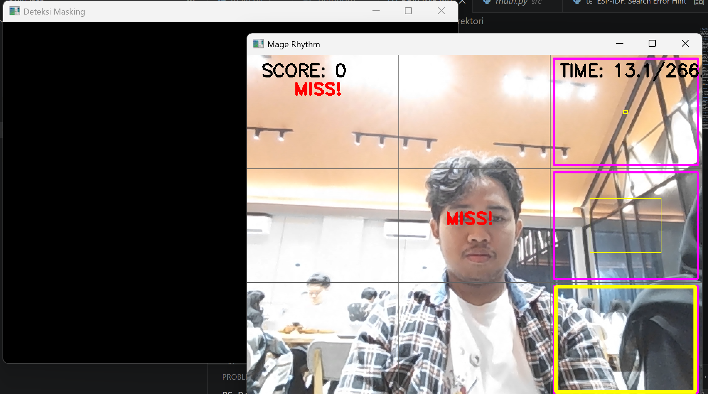
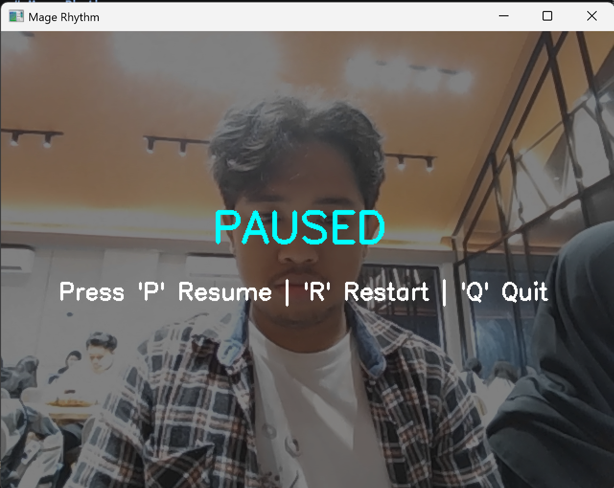
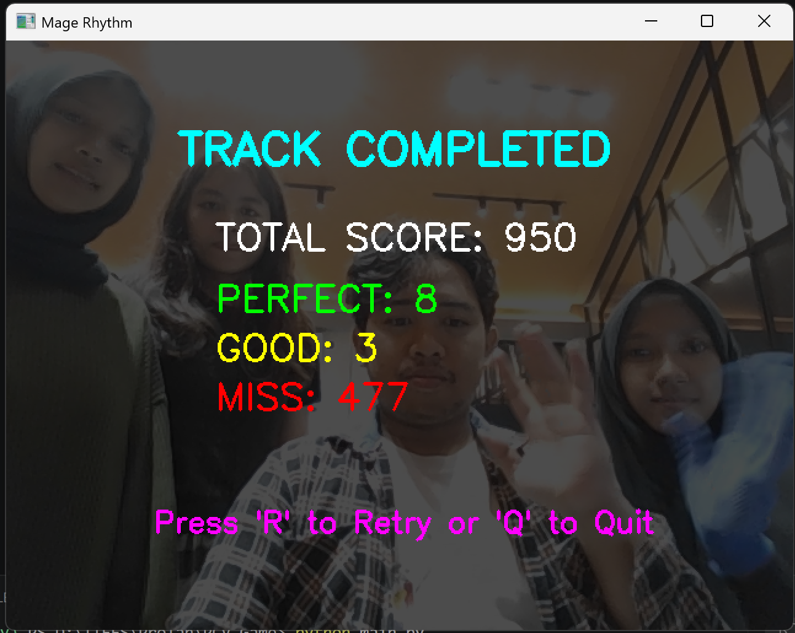

# Mage Rhythm

Mage Rhythm adalah mini game rhythm berbasis Computer Vision yang menggunakan webcam sebagai alat input utama. Pemain mengontrol senjata virtual menggunakan posisi tangan dan harus melakukan gesture kepalan tangan (fist gesture) pada waktu yang tepat untuk menghancurkan target ritme yang muncul mengikuti irama lagu.

Proyek ini dikembangkan menggunakan Python, OpenCV, dan NumPy dengan pendekatan pengolahan citra digital secara real-time.

---

## Tema Project

Tema yang diangkat adalah **Handweapon Mini Game**, di mana tangan pemain berfungsi sebagai pengendali senjata virtual untuk menghancurkan target ritme pada layar.

Konsep utama permainan:

- Tangan pemain dideteksi menggunakan segmentasi warna.
- Posisi tangan digunakan untuk menggerakkan senjata virtual.
- Gesture kepalan tangan digunakan sebagai aksi menyerang.
- Target ritme muncul berdasarkan BPM lagu.
- Pemain memperoleh skor berdasarkan ketepatan waktu menyerang target.

---

## Fitur Utama

### Hand Tracking

Posisi tangan dideteksi secara real-time menggunakan webcam dan digunakan untuk mengontrol posisi senjata virtual pada layar.

### Skin Color Segmentation

Deteksi tangan dilakukan menggunakan segmentasi warna pada ruang warna HSV.

Tahapan:

1. Konversi frame BGR ke HSV.
2. Pembuatan skin mask.
3. Ekstraksi area tangan.
4. Pencarian kontur terbesar sebagai kandidat tangan.

### Gesture Detection

Game mengenali satu jenis gesture:

**Fist Gesture (Kepalan Tangan)**

Deteksi dilakukan menggunakan perbandingan luas kontur terhadap convex hull (solidity).

```python
solidity = area / hull_area

if solidity > 0.88:
    is_fist = True
```

Gesture ini digunakan sebagai aksi menyerang target.

### Weapon Overlay

Sprite senjata ditempelkan pada posisi tangan menggunakan alpha blending.

Fitur:

- Mengikuti pergerakan tangan secara real-time.
- Transparansi diproses menggunakan channel alpha PNG.
- Posisi senjata berada pada centroid tangan yang terdeteksi.

### Rhythm Target System

Target ritme dihasilkan secara otomatis berdasarkan BPM lagu Freedom Dive.

Mekanisme:

- Layar dibagi menjadi 9 zona (3×3 grid).
- Target muncul pada zona acak.
- Target membesar seiring mendekati waktu hit.
- Pemain harus melakukan serangan pada zona yang benar.

### Score System

Penilaian dilakukan berdasarkan ketepatan waktu saat menyerang target.

| Hasil | Skor |
|---------|---------|
| Perfect | +100 |
| Good | +50 |
| Miss | 0 |

Statistik yang ditampilkan:

- Total Score
- Perfect Count
- Good Count
- Miss Count

### Pause dan Restart

Kontrol permainan:

| Tombol | Fungsi |
|---------|---------|
| P | Pause / Resume |
| R | Restart |
| Q | Quit |

---

## Implementasi Requirement

### Video Capture

Menggunakan webcam laptop sebagai sumber input video.

Fungsi OpenCV yang digunakan:

```python
cv2.VideoCapture()
cv2.imshow()
cv2.imread()
```

### Segmentasi Warna Kulit

Menggunakan ruang warna HSV:

```python
lower_skin = np.array([100, 100, 50])
upper_skin = np.array([130, 255, 255])
```

Mask biner digunakan untuk menemukan area tangan secara real-time.

### Operasi Morfologi

Mask hasil segmentasi diproses menggunakan:

- Opening
- Closing

untuk mengurangi noise dan memperbaiki bentuk objek tangan.

### Weapon Sprite Overlay

Overlay senjata dilakukan menggunakan alpha blending:

```python
blended =
weapon_rgb * alpha +
background * (1 - alpha)
```

### Gesture Recognition

Gesture yang dikenali:

- Fist Gesture

Gesture digunakan untuk memicu aksi menyerang target.

### Second Object

Objek kedua dalam permainan berupa target ritme yang muncul pada sembilan zona permainan.

### Score System

Sistem skor menghitung:

- Perfect
- Good
- Miss

secara real-time selama permainan berlangsung.

---

## Struktur Direktori

```text
PCV Game/
├── main.py
├── freedom_dive.mp3
├── weapon.png
├── assets/
│   ├── screenshots/
│   │   ├── image.png
│   │   ├── pause.png
│   │   └── quit.png
│   └── video/
│       └── Demo Game PCV.mp4
└── README.md
```

---

## Cara Menjalankan

Install dependensi:

```bash
pip install opencv-python numpy pygame
```

Jalankan game:

```bash
python main.py
```

Pastikan:

- Webcam aktif.
- File `weapon.png` tersedia.
- File `freedom_dive.mp3` tersedia.
- Pencahayaan cukup agar tangan dapat terdeteksi dengan baik.

---

## Screenshot dan Demo

### Gameplay



### Pause



### Quit



### Video Demonstrasi

[Demo Game](assets/video/Demo%20Game%20PCV.mp4)

---

## Catatan pengembangan

Proyek ini masih dapat ditingkatkan dengan:
- penambahan deteksi gesture yang lebih akurat,
- pengaturan threshold warna kulit yang lebih adaptif,
- integrasi level dan skema musik yang lebih variatif,
- penyimpanan skor dan replay.
